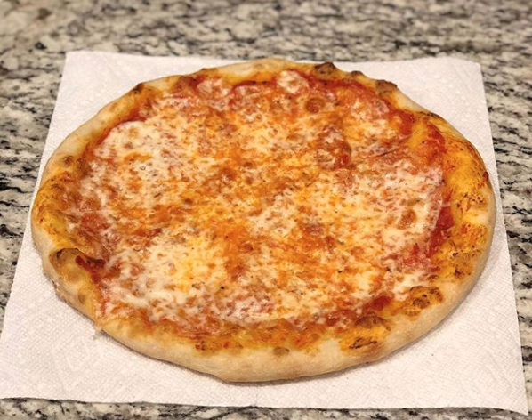

# loren's pizza recipe

## dough

ingredients

- 300g King Arthur Bread Flour
- 90g All Purpose Flour
- 7g Instant Yeast
- 1 tsp salt
- 1/4 cup Olive Oil
- 1 cup water

combine by hand until the mixture forms a shaggy dough

sit covered for 20m

knead

divide into 3 220g dough balls

refrigerate for 24-72 hours
 
## sauce

ingredients

- 1 can Cento San Marzano tomatoes
- salt
- pepper
- oregano
- garlic

stick blend the entire can of tomatoes

add salt, pepper, oregano & garlic (can be minced, powdered, whatever) to taste

store in a jar in the fridge overnight until the water separates (in a 16oz mason jar there should be about an inch of water at the bottom).

## cheese

- low moisture whole milk mozzarella
- shredded parmesan
- (optional) asiago, provelone, etc

as long as most of the cheese is mozz, you can do whatever you like here

try to keep the ratio of cheese to sauce 1:1

# step by step

preheat oven as hot as it will go with a pizza stone inside

using your fingertips gently press a circle around the dough leaving 1/2" of the edge untouched (for the crust)

stretch the dough into a 12" circle, avoid touching the edge too much

put some flour and/or cornmeal onto a pizza peel and lay the dough on it

scooping from the top of the jar with a spoon, add 2-4oz of sauce to the dough

sprinkle some oregano on top of the sauce

add cheese

slide the pizza onto your hot pizza stone and cook until the cheese is melted and the crust begins to speckle and brown

rest for a minute or two and enjoy!
