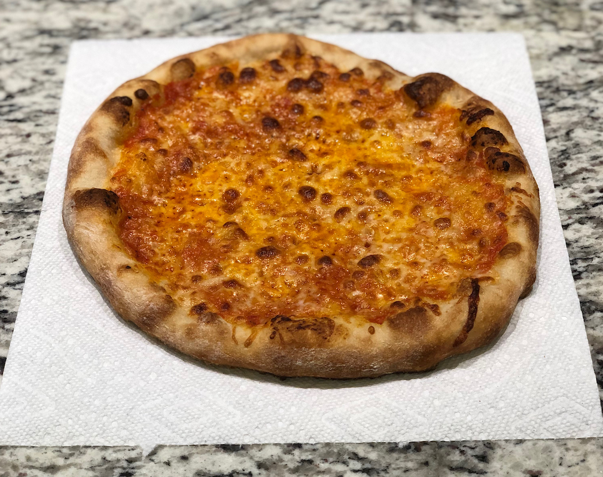

# loren's pizza recipe

## dough

ingredients

- 400g King Arthur bread flour
- 240g water (~60%)
- 5 to 10g salt
- 10g agave syrup / honey / sugar
- 3g instant yeast

combine flour salt & yeast in a large bowl

dissolve the sugar into the water and combine with dry ingredients by hand until the mixture forms a shaggy dough

sit covered for 20 minutes to an hour to hydrate the dough

divide the dough into 3 portions (should be ~220g each) and gently fold each into a ball

refrigerate for 24-72 hours
 
## sauce

ingredients

- 1 can Cento San Marzano tomatoes
- salt
- pepper
- oregano
- garlic
- olive oil

stick blend the entire can of tomatoes

add olive oil, salt, pepper, oregano & garlic (can be minced, powdered, whatever) to taste

store in a jar in the fridge overnight, you _can_ use it immediately, but it's much better the next day

## cheese

- low moisture whole milk mozzarella
- shredded parmesan
- (optional) asiago, fontina, provelone, etc

as long as most of the cheese is mozz, you can do whatever you like here

try to keep the ratio of cheese to sauce 1:1

# step by step

preheat oven as hot as it will go with a pizza steel inside

using your fingertips gently press a circle into the dough leaving 1" of the edge untouched (for the crust)

stretch the dough (using your knuckles) into a 12" circle, avoid touching the edge too much

put some flour and/or cornmeal onto a pizza peel and lay the dough on it

scooping from the top of the jar with a spoon, add 2-4oz of sauce to the dough

sprinkle some oregano on top of the sauce

add cheese

slide the pizza onto your hot pizza steel and cook until the cheese is melted and the crust begins to speckle and brown, ideally 5-8 minutes.

rest for a minute or two and enjoy!
